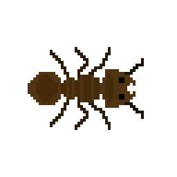
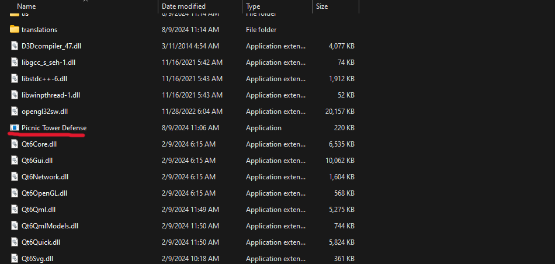
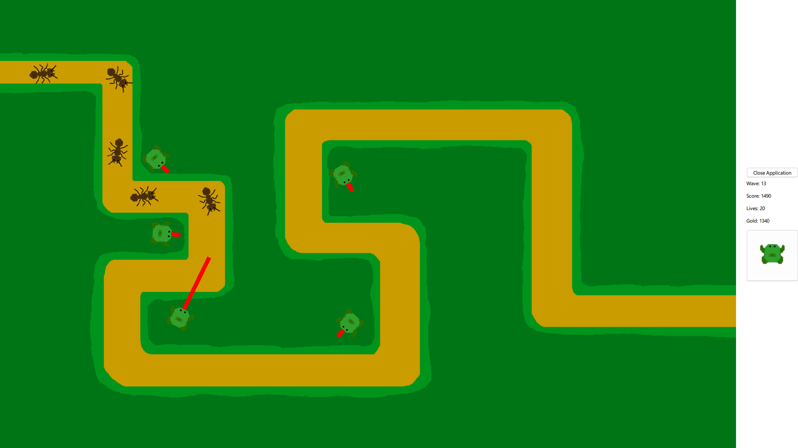

# Picnic Tower Defense

## Description

This project is a simple tower defense game I made over the course of a summer where the player calls upon the help of frogs to defend a picnic basket from an endless swarm of hungry ants. There is currently no game over screen. Instead, if the player runs out of lives their score will stop increasing. 

Before starting this project I researched a varity of programs such as [SDL](https://www.libsdl.org) and [OpenGL](https://www.opengl.org). But I decided to work with [Qt Qml](https://doc.qt.io/qt-6/qtqml-index.html) due to its popularity with other types of projects and because I already had some experience developing with [Qt](https://www.qt.io).

## Installation

Download the latest release then unzip the folder and run the file "PicnicTowerDefense.exe" to play Picnic Tower Defense yourself!

## Usage

This game is meant to be shared and enjoyed! 

## Credits

This project was soley developed by me, [Benjamin Sidwell](https://github.com/SoccDoc).

To code our GUI for this project I used Qml in [Qt](https://doc.qt.io/qt-6/qtqml-index.html).

All of the art assets for this game were drawn by me in [Piskel](https://www.piskelapp.com)
